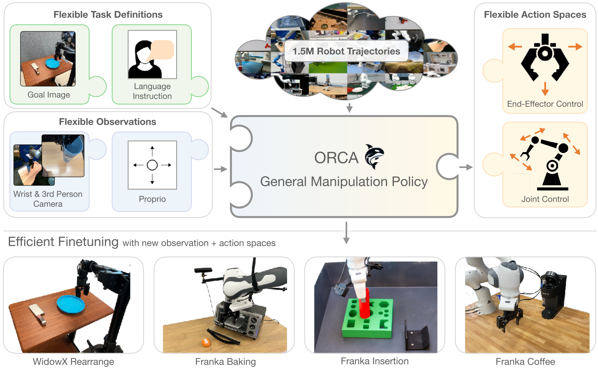

# Octo


This repo contains code for training and finetuning Octo generalist robotic policies (GRPs).
Octo models are transformer-based diffusion policies, trained on a diverse mix of 800k robot trajectories.

## Get Started

Follow the installation instructions, then load a pre-trained OCTO model! See [examples](examples/) for guides to zero-shot evaluation and finetuning.

```
from octo.model.octo_model import OCTOModel
model = OCTOModel.load_pretrained("hf://rail-berkeley/octo-base")
```



Out of the box, Octo supports multiple RGB camera inputs, can control various robot arms,
and can be instructed via language commands or goal images.
Octo uses a modular attention structure in its transformer backbone, allowing it to be effectively finetuned
to robot setups with new sensory inputs, action spaces, and morphologies, using only a small target domain
dataset and accessible compute budgets.


## Installation
```bash
conda create -n octo python=3.10
conda activate octo
pip install -e .
pip install -r requirements.txt
```
For GPU:
```bash
pip install --upgrade "jax[cuda11_pip]==0.4.20" -f https://storage.googleapis.com/jax-releases/jax_cuda_releases.html
```

For TPU
```bash
pip install --upgrade "jax[tpu]==0.4.20" -f https://storage.googleapis.com/jax-releases/libtpu_releases.html
```
See the [Jax Github page](https://github.com/google/jax) for more details on installing Jax.

Test the installation by finetuning on the debug dataset:
```bash
python scripts/finetune.py --config.pretrained_path=hf://rail-berkeley/octo-small --debug
```

## Checkpoints

You can find pretrained Octo checkpoints [here](https://huggingface.co/rail-berkeley).
At the moment we provide the following model versions:

| Model                                                         | Inference on 1x NVIDIA 4090 | Size       |
|---------------------------------------------------------------|-----------------------------|------------|
| [Octo-Base](https://huggingface.co/rail-berkeley/octo-base)   | 13 it/sec                   | 93M Params |
| [Octo-Small](https://huggingface.co/rail-berkeley/octo-small) | 17 it/sec                   | 27M Params |


## Examples

We provide simple [example scripts](examples) that demonstrate how to use and finetune Octo models,
as well as how to use our data loader independently. We provide the following examples:

|                                                                   |                                                                                                                 |
|-------------------------------------------------------------------|-----------------------------------------------------------------------------------------------------------------|
| [Octo Inference](examples/01_inference_pretrained.ipynb)          | Minimal example for loading and running a pretrained Octo model                                            |
| [Octo Finetuning](examples/02_finetune_new_observation_action.py) | Minimal example for finetuning a pretrained Octo models on a small dataset with a new observation and action space |
| [Octo Rollout](examples/03_eval_finetuned.py)                     | Run a rollout of a pretrained Octo policy in a Gym environment                                                 |
| [Octo Robot Eval](examples/04_eval_finetuned_on_robot.py)         | Evaluate a pretrained Octo model on a real WidowX robot                                                        |
| [OpenX Dataloader Intro](examples/05_dataloading.ipynb)           | Walkthrough of the features of our Open X-Embodiment data loader                                                |


## Octo Pretraining

To reproduce our Octo pretraining on 800k robot trajectories, run:
```bash
python scripts/train.py --config scripts/configs/octo_pretrain_config.py:<size> --name=octo --config.dataset_kwargs.oxe_kwargs.data_dir=... --config.dataset_kwargs.oxe_kwargs.data_mix=oxe_magic_soup ...
```

To download the pretraining dataset from the [Open X-Embodiment Dataset](https://robotics-transformer-x.github.io/),
install the [rlds_dataset_mod package](https://github.com/kpertsch/rlds_dataset_mod)
and run the [prepare_open_x.sh script](https://github.com/kpertsch/rlds_dataset_mod/blob/main/prepare_open_x.sh).
The total size of the pre-processed dataset is ~1.2TB.

We run pretraining using a TPUv4-128 pod in 8 hours for the Octo-S model and in 14 hours for Octo-B.


## Octo Finetuning

We provide a [minimal example](examples/02_finetune_new_observation_action.py) for finetuning with a new observation and action space.

We also provide a more advanced finetuning script that allows you to change hyperparameters via a config file and logs finetuning
metrics. To run advanced finetuning, use:
```bash
python scripts/finetune.py --config.pretrained_path=hf://rail-berkeley/octo-small
```

We offer three finetuning modes depending on the parts of the model that are kept frozen: ```head_only```, ```head_mlp_only```, and ```full``` to finetune the full model.
Additionally, one can specify the task type to finetune with: ```image_conditioned```, ```language_conditioned``` or ```multimodal``` for both.
For example, to finetune the full transformer with image inputs only use:
```--config=finetune_config.py:full,image_conditioned```.


## Octo Evaluation

Loading and running a trained Octo model is as easy as:
```python
from octo.model import OctoModel

model = OctoModel.load_pretrained("hf://rail-berkeley/octo-small")
task = model.create_tasks(texts=["pick up the spoon"])
action = model.sample_action(observation, task, rng=jax.random.PRNGKey(0))
```

We provide examples for evaluating Octo [in a simulated Gym environment](examples/03_eval_finetuned.py) as well
as [on a real WidowX robot](examples/04_eval_finetuned_on_robot.py).

To evaluate on your own environment, simply wrap it in a Gym interface and follow the instructions in the
[Eval Env README](examples/envs/README.md).


## Code Structure

|                     | File                                                    | Description                                                                   |
|---------------------|---------------------------------------------------------|-------------------------------------------------------------------------------|
| Hyperparameters     | [config.py](scripts/configs/config.py)                  | Defines all hyperparameters for the training run.                             |
| Pretraining Loop    | [train.py](scripts/train.py)                            | Main pretraining script.                                                         |
| Finetuning Loop     | [finetune.py](scripts/finetune.py)                      | Main finetuning script.                                                       |
| Datasets            | [dataset.py](octo/data/dataset.py)                      | Functions for creating single / interleaved datasets + data augmentation.     |
| Tokenizers          | [tokenizers.py](octo/model/components/tokenizers.py)    | Tokenizers that encode image / text inputs into tokens.                       |
| Octo Model          | [octo_model.py](octo/model/octo_model.py)               | Main entrypoint for interacting with Octo models: loading, saving, and inference. |
| Model Architecture  | [octo_module.py](octo/model/octo_module.py)             | Combines token sequencing, transformer backbone and readout heads.            |
| Visualization       | [visualization_lib.py](octo/utils/visualization_lib.py) | Utilities for offline qualitative & quantitative eval.                        |
