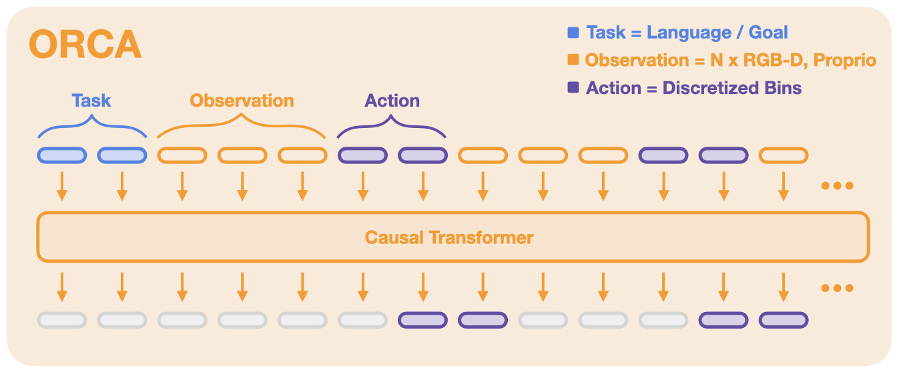

# ORCA


This repo contains code for training and finetuning ORCA generalist robotic models (GRMs).
ORCA models are transformer-based diffusion policies, trained on a diverse mix of >1M robot trajectories.



We tokenize **task definitions** (like language instructions or goals), **observations** (like RGB-D images and proprioception)
and **actions**. Given the sequence of input tokens, the model is trained to predict the action tokens.

## Installation
```bash
conda create -n orca python=3.10
conda activate orca
pip install -e .
pip install -r requirements.txt
```
For GPU:
```bash
pip install --upgrade "jax[cuda11_pip]==0.4.20" -f https://storage.googleapis.com/jax-releases/jax_cuda_releases.html
```

For TPU
```
pip install --upgrade "jax[tpu]==0.4.20" -f https://storage.googleapis.com/jax-releases/libtpu_releases.html
```
See the [Jax Github page](https://github.com/google/jax) for more details on installing Jax.

Test the installation by training on the debug dataset:
```bash
python train.py --config tests/debug_config.py --debug
```

## Checkpoints

You can find pre-trained ORCA checkpoints [here](huggingface.com).
At the moment we provide the following model versions:

| Model                     | Size       |
|---------------------------|------------|
| [ORCA-B](huggingface.com) | XXX Params |
| [ORCA-S](huggingface.com) | XXX Params |


## Examples

We provide simple [example scripts](examples) that demonstrate how to inference and finetune ORCA models,
as well as how to use our data loader independently. We provide the following examples:

|                                                                   | Content                                                                                                         |
|-------------------------------------------------------------------|-----------------------------------------------------------------------------------------------------------------|
| [ORCA Inference](examples/01_inference_pretrained.ipynb)          | Minimal example for loading and inferencing a pre-trained ORCA model                                            |
| [ORCA Finetuning](examples/02_finetune_new_observation_action.py) | Minimal example for finetuning a pre-trained ORCA models on a small dataset with new observation + action space |
| [ORCA Rollout](examples/03_eval_finetuned.py)                     | Run a rollout of a pre-trained ORCA policy in a Gym environment                                                 |
| [ORCA Robot Eval](examples/04_eval_finetuned_on_robot.py)         | Evaluate a pre-trained ORCA model on a real WidowX robot                                                        |
| [OpenX Dataloader Intro](examples/05_dataloading.ipynb)           | Walkthrough of the features of our Open X-Embodiment data loader                                                |


## ORCA Pre-Training

To reproduce our ORCA pre-training on >1M robot trajectories, run:
```
python train.py --config config.py:vit_s --name=orca --config.dataset_kwargs.oxe_kwargs.data_dir=... --config.dataset_kwargs.oxe_kwargs.data_mix=oxe_magic_soup ...
```
Check out ...

[I will put in more info regarding data download etc]

## ORCA Finetuning

[I will put in info regarding advanced finetuning script]


## ORCA Evaluation

[I will add info about the WidowX example and some documentation for wrapping general gym envs to be compatible]


## Code Structure

|                     | File                                                    | Description                                                                   |
|---------------------|---------------------------------------------------------|-------------------------------------------------------------------------------|
| Hyperparameters     | [config.py](scripts/configs/config.py)                  | Defines all hyperparameters for the training run.                             |
| Training Loop       | [train.py](scripts/train.py)                            | Main training script.                                                         |
| Finetuning Script   | [finetune.py](scripts/finetune.py)                      | Main finetuning script.                                                       |
| Datasets            | [dataset.py](orca/data/dataset.py)                      | Functions for creating single / interleaved datasets + data augmentation.     |
| Tokenizers          | [tokenizers.py](orca/model/components/tokenizers.py)    | Tokenizers that encode image / text inputs into tokens.                       |
| ORCA Model          | [orca_model.py](orca/model/orca_model.py)               | Main entrypoint for interacting with ORCA models, loading, saving, inference. |
| Model Architecture  | [orca_module.py](orca/model/orca_module.py)             | Combines token sequencing, transformer backbone and readout heads.            |
| Visualization       | [visualization_lib.py](orca/utils/visualization_lib.py) | Utilities for offline qualitative & quantitative eval.                        |


## Contributing
Experimental things and training/eval scripts should go in `experiments/<your_name>`. To make any changes to files outside of your experiments directory, please open a pull request.

Steps to contribute:
1. Fork the repo and create your branch from `master`.
2. Use `pre-commit` to enable code checks and auto-formatting.
3. Test that a basic training starts with the debug dataset with: ```
python train.py --config tests/debug_config.py
```
